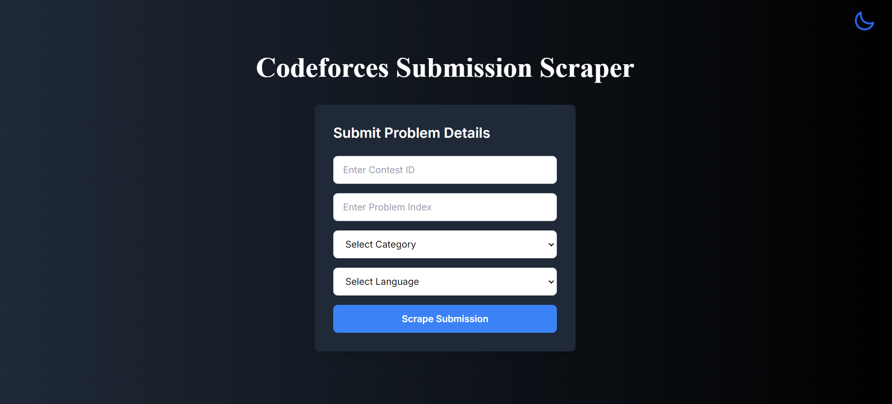
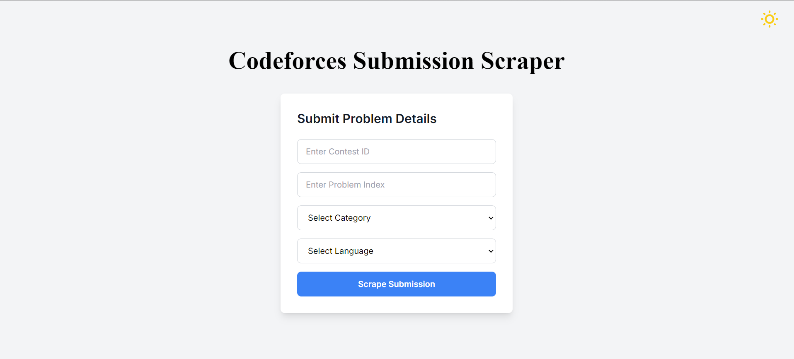

<p align="center">
  
</p>

<div align="center">
  
  
  
  
  
  
</div>

<br>


<br>

<p align="center"><br><br>
<a href="#introduction"><kbd><br>&emsp;Introduction&emsp;<br><br></kbd></a>&emsp;
<a href="#how-it-works"><kbd><br>&emsp;How It Works&emsp;<br><br></kbd></a>&emsp;
<a href="#features"><kbd><br>&emsp;Features&emsp;<br><br></kbd></a>&emsp;
<a href="#preview"><kbd><br>&emsp;Preview&emsp;<br><br></kbd></a>&emsp;
<a href="#tech-stack"><kbd><br>&emsp;Tech Stack&emsp;<br><br></kbd></a>&emsp;
<a href="#getting-started"><kbd><br>&emsp;Getting Started&emsp;<br><br></kbd></a>&emsp;
<a href="#issues"><kbd><br>&emsp;Issues&emsp;<br><br></kbd></a>&emsp;
<a href="#license"><kbd><br>&emsp;License&emsp;<br><br></kbd></a>&emsp;
<a href="#contact"><kbd><br>&emsp;Contact&emsp;<br><br></kbd></a>
<br><br>
</p>

## Introduction

**CF Helper** is a web application designed to simplify the process of finding and understanding solutions to Codeforces problems. Built using **Next.js**, it leverages **Gemini API** for providing detailed explanations and **Cheerio** for web scraping solutions from the web.

This project is open for contributions during **Hacktoberfest 2024**! Whether you're new to open source or an experienced developer, we welcome all contributions. 🎉


## How It Works

**CF Helper** works by allowing users to input specific criteria to find solutions for Codeforces problems. Here's how the process flows:

1. **Input Criteria**:
   - **Contest ID**: Specify the contest id (e.g., 1234), visible in the url of contest.
   - **Problem Number**: Select the question by letter (e.g., A, B, C, etc.).
   - **Preferred Language**: Supports a wide range of programming languages (C++, Python, Java, etc.).
   - **Preferred Rating**: Choose a rating level (Newbie, Pupil, Expert, etc.) whose solution you wish to view.

2. **Web Scraping**: Once you've entered the criteria, CF Helper uses **Cheerio** to scrape the web and fetch the exact solution that meets your preferences.

3. **Solution Explanation**: After fetching the solution, CF Helper integrates with the **Gemini API** to provide a detailed, step-by-step explanation of the solution, if requested by the user.

4. **Results**: You get the solution and the explanation delivered right to your screen, helping you understand the approach clearly and effectively.

## Features

- **Custom Problem Search**: Enter the contest ID, problem number, language, and rating level to get the exact solution you're looking for.
- **Web Scraping**: Automatically fetches Codeforces problem solutions using Cheerio.
- **Solution Explanation**: Provides detailed explanations via the Gemini API, helping you understand the logic behind the solution.
- **Multi-language Support**: Find solutions in your preferred programming language.
- **User-friendly Interface**: Easily navigate through the solutions and explanations with an intuitive UI.

## Preview

<div align="center">
  <table>
    <h2 id="preview">Preview</h2>
    <tr>
      <td>
        
      </td>
      <td>
        
      </td>
    </tr>
    <tr>
      <td>
        
      </td>
    </tr>
  </table>
</div>


## Tech Stack

- **Frontend**: [Next.js](https://nextjs.org/)
- **Backend**: [Gemini API](https://gemini.com/)
- **Web Scraping**: [Cheerio](https://cheerio.js.org/)
- **Deployment**: [Cf-helper](https://cf-helper-peach.vercel.app)

## Getting Started

### Prerequisites

To run this project, you'll need a **Gemini API key**. Follow the instructions below to generate your API key:

1. **Go to Gemini Website**: Click here [Gemini](https://ai.google.dev/gemini-api/docs/api-key?_gl=1*1klljxm*_up*MQ..&gclid=Cj0KCQjwmOm3BhC8ARIsAOSbapWP4oB-w6LcagtmEx3xpiPmTyKSX9lGIRtdn9jdgi5w-_jPmUOCI9caAmzcEALw_wcB&gbraid=0AAAAACn9t66MVbyJrz0E2MZ6eK9APnX1H).
2. **Generate an API Key**: Read the steps given on this website to generate an API key for generating gemini responses.

> [!NOTE]
> *You can use your API key for testing and running your application locally. However, ensure to revert your API key in the `.env.sample` file back to "your_gemini_api_key" before pushing your changes.*
> *Please remember that your Gemini API key is personal and should not be shared or exposed in your codebase.*

### Setup Instructions


1. **Fork the repository**: Click the "Fork" button at the top of this page.
2. **Clone your fork**:
   ```bash
   git clone https://github.com/your-username/cf_helper.git
   ```
3. **Install dependencies**:
   ```bash
   npm install
   ```
4. **Create a .env file in the root directory of the project and add your Gemini API key**:
   ```bash
   YOUR_API_KEY=your_api_key_here

   ```
5. **Run the project locally**:
   ```bash
   npm run dev
   ```
   The app will be available at [http://localhost:3000](http://localhost:3000).

---
Check out the [Contributing Guide](Contributing.md) for more information.
---

## Contributors

<p align="center">
  <a href="https://github.com/shuklamaneesh23/cf_helper/graphs/contributors">
    
  </a>
</p>


## Issues

Feel free to submit issues and feature requests [here](https://github.com/shuklamaneesh23/cf_helper/issues).

## License

This project is licensed under the MIT License. See the [LICENSE](LICENSE) file for more information.

## Contact

If you have any questions or need further assistance, feel free to open an issue or contact the maintainers.

---

Looking forward to your contributions! Let's make **CF Helper** better together this Hacktoberfest! 🌟

---
